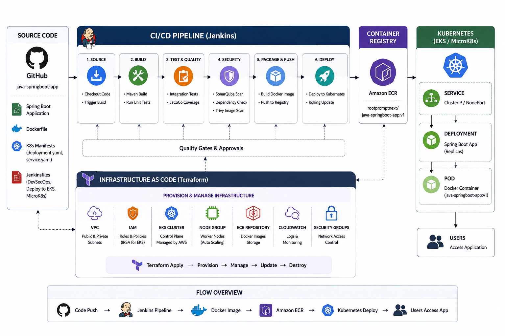

# Java Spring Boot DevOps Application

<p align="center">
  
</p>

<p align="center">


</p>


# Project Overview

This repository contains a complete **Java Spring Boot Employee Management application** designed as a practical **DevOps / DevSecOps / Kubernetes / Observability lab**.

The application is progressively integrated with modern DevOps tools and practices:

```text
Java Spring Boot
       │
       ├── Maven
       ├── JUnit
       ├── JaCoCo
       │
       ├── Docker
       │
       ├── Kubernetes
       │
       ├── Jenkins CI/CD
       │
       ├── DevSecOps
       │
       └── Observability
             ├── Spring Boot Actuator
             ├── Micrometer
             ├── Prometheus
             └── Grafana
````

The same application can be used to demonstrate:

* Application development
* Maven build automation
* Automated testing
* Code coverage
* Docker containerization
* Kubernetes deployment
* Jenkins CI/CD
* DevSecOps pipelines
* Prometheus monitoring
* Grafana dashboards
* MicroK8s deployment
* Amazon EKS deployment
* GitHub Actions self-hosted runners

---

# Application Architecture

The application is a simple Employee Management application.

```text
                    Spring Boot Application
                            │
                ┌───────────┴───────────┐
                │                       │
             Web UI                 REST API
                │                       │
          Thymeleaf +             /api/employees
            Bootstrap                   │
                │                       │
                └───────────┬───────────┘
                            │
                     EmployeeController
                            │
                     EmployeeService
                            │
                     In-Memory Map
```

Current application functionality:

* View employees
* Add employee
* Delete employee
* REST API
* HTML UI using Thymeleaf
* Bootstrap frontend
* Unit testing
* Integration testing

---

# Technology Stack

| Category                | Technology                                           |
| ----------------------- | ---------------------------------------------------- |
| Language                | Java 21                                              |
| Framework               | Spring Boot                                          |
| Build                   | Maven                                                |
| Frontend                | Thymeleaf + Bootstrap                                |
| Testing                 | JUnit 5                                              |
| Code Coverage           | JaCoCo                                               |
| Container               | Docker                                               |
| Container Orchestration | Kubernetes                                           |
| Local Kubernetes        | MicroK8s                                             |
| Cloud Kubernetes        | Amazon EKS                                           |
| CI/CD                   | Jenkins                                              |
| DevSecOps               | SonarQube/SonarCloud, Trivy and other pipeline tools |
| Monitoring              | Spring Boot Actuator                                 |
| Metrics                 | Micrometer                                           |
| Metrics Storage         | Prometheus                                           |
| Visualization           | Grafana                                              |
| Automation              | GitHub Actions                                       |


# Repository Structure

```text
java-springboot-app/
│
├── Dockerfile
│
├── pom.xml
│
├── README.md
├── monitoring.md
│
├── ci-cd-iac-project-overview.png
│
├── deployment.yaml
│
├── Jenkinsfile-app-deploy-eks
├── Jenkinsfile-app-deploy-microk8s
├── Jenkinsfile-devsecops
│
├── monitoring/
│   ├── docker-compose.yaml
│   │
│   └── prometheus/
│       └── prometheus.yml
│
└── src/
    │
    ├── main/
    │   │
    │   ├── java/
    │   │   └── com/example/demo/
    │   │       │
    │   │       ├── DemoApplication.java
    │   │       │
    │   │       ├── controller/
    │   │       │   └── EmployeeController.java
    │   │       │
    │   │       ├── model/
    │   │       │   └── Employee.java
    │   │       │
    │   │       └── service/
    │   │           └── EmployeeService.java
    │   │
    │   └── resources/
    │       │
    │       ├── application.properties
    │       │
    │       └── templates/
    │           ├── index.html
    │           └── form.html
    │
    └── test/
        └── java/
            └── com/example/demo/
                ├── UnitTest.java
                └── IntegrationTest.java
```

> `target/` is generated by Maven and should not be committed to Git.

# 1. Prerequisites

Install:

* Java 21
* Maven
* Git
* Docker
* Docker Compose
* kubectl
* Kubernetes cluster if deploying to Kubernetes

Verify Java:

```bash
java -version
```

Expected:

```text
openjdk version "21..."
```

Verify Maven:

```bash
mvn -version
```

# 2. Build the Application

Clone the repository:

```bash
git clone https://github.com/rootpromptnext/java-springboot-app.git
cd java-springboot-app
```

Build:

```bash
mvn clean package
```

Run tests:

```bash
mvn test
```

Run complete verification:

```bash
mvn clean verify
```

# 3. Testing

The project contains:

### Unit Test

```text
src/test/java/com/example/demo/UnitTest.java
```

Run:

```bash
mvn test
```

### Integration Test

```text
src/test/java/com/example/demo/IntegrationTest.java
```

Run:

```bash
mvn verify
```

# 4. JaCoCo Code Coverage

JaCoCo is integrated into Maven.

Run:

```bash
mvn clean verify
```

Coverage report:

```text
target/site/jacoco/index.html
```

Open it in a browser.

# 5. Run Spring Boot Application

Run using Maven:

```bash
mvn spring-boot:run
```

Or build and run the JAR:

```bash
mvn clean package
```

```bash
java -jar target/java-springboot-app-1.0.0.jar
```

Application:

```text
http://localhost:8080
```

# 6. Application Endpoints

### Employee UI

```text
/
```

### Add Employee

```text
/form
```

### Add Employee API

```text
POST /add
```

### Delete Employee

```text
/delete/{id}
```

### REST API

```text
/api/employees
```

Test:

```bash
curl http://localhost:8080/api/employees
```

# 7. Docker

The project contains a multi-stage Dockerfile.

```text
Dockerfile
```

The Dockerfile uses:

```text
Maven + JDK
      │
      │ Build
      ▼
Spring Boot JAR
      │
      ▼
Java Runtime Image
```

Build:

```bash
docker build -t java-springboot-app .
```

Run:

```bash
docker run -d \
  --name java-springboot-app \
  -p 8080:8080 \
  java-springboot-app
```

Check:

```bash
docker ps
```

Application:

```text
http://localhost:8080
```

Stop:

```bash
docker stop java-springboot-app
```

Remove:

```bash
docker rm java-springboot-app
```

# 8. Kubernetes Deployment

Kubernetes manifest:

```text
deployment.yaml
```

Apply:

```bash
kubectl apply -f deployment.yaml
```

Check:

```bash
kubectl get pods
```

```bash
kubectl get svc
```

```bash
kubectl get deployment
```

Check everything:

```bash
kubectl get all
```

# 9. MicroK8s Deployment

The application can be deployed to MicroK8s.

Verify:

```bash
microk8s status
```

Check nodes:

```bash
kubectl get nodes
```

Deploy:

```bash
kubectl apply -f deployment.yaml
```

Verify:

```bash
kubectl get pods
```

```bash
kubectl get svc
```

# 10. Amazon EKS Deployment

The repository also contains a Jenkins pipeline for EKS:

```text
Jenkinsfile-app-deploy-eks
```

The pipeline can be used to automate:

```text
Git
 │
 ▼
Jenkins
 │
 ├── Build
 ├── Test
 ├── Docker Build
 ├── Docker Push
 └── Deploy
       │
       ▼
      EKS
```

# 11. Jenkins CI/CD

Jenkins pipelines included in this repository:

```text
Jenkinsfile-app-deploy-eks
Jenkinsfile-app-deploy-microk8s
Jenkinsfile-devsecops
```

### EKS Deployment

```text
Jenkinsfile-app-deploy-eks
```

### MicroK8s Deployment

```text
Jenkinsfile-app-deploy-microk8s
```

### DevSecOps Pipeline

```text
Jenkinsfile-devsecops
```

Typical pipeline:

```text
Developer
    │
    ▼
 Git Repository
    │
    ▼
  Jenkins
    │
    ├── Checkout
    │
    ├── Maven Build
    │
    ├── Unit Tests
    │
    ├── Integration Tests
    │
    ├── JaCoCo
    │
    ├── SAST
    │
    ├── Dependency/SCA Scan
    │
    ├── Container Build
    │
    ├── Container Security Scan
    │
    ├── Push Image
    │
    └── Kubernetes Deployment
```

# 12. DevSecOps

The repository contains:

```text
Jenkinsfile-devsecops
```

The pipeline can be extended with:

* SAST
* SCA
* Secret scanning
* Container scanning
* Quality gates
* Security gates
* Artifact management

Typical tools:

```text
Source Code
     │
     ▼
   SAST
     │
     ▼
    SCA
     │
     ▼
Secret Scan
     │
     ▼
Docker Build
     │
     ▼
Container Scan
     │
     ▼
Registry
     │
     ▼
Kubernetes
```

# 13. Prometheus Monitoring

Spring Boot monitoring is implemented using:

```text
Spring Boot Actuator
        │
        ▼
     Micrometer
        │
        ▼
 Prometheus Registry
        │
        ▼
/actuator/prometheus
```

The application exposes:

```text
/actuator/health
/actuator/prometheus
```

Test health:

```bash
curl http://localhost:8080/actuator/health
```

Expected:

```json
{"status":"UP"}
```

Test Prometheus metrics:

```bash
curl http://localhost:8080/actuator/prometheus
```

Check JVM memory:

```bash
curl http://localhost:8080/actuator/prometheus | grep jvm_memory_used_bytes
```

Example metrics include:

```text
jvm_memory_used_bytes
jvm_memory_max_bytes
jvm_threads_live_threads
jvm_gc_pause_seconds
process_cpu_usage
process_uptime_seconds
http_server_requests_seconds
disk_free_bytes
disk_total_bytes
```

Detailed monitoring instructions:

# 14. Prometheus + Grafana

```

                Docker Compose
                     │
        ┌────────────┼────────────┐
        │            │            │
        ▼            ▼            ▼
 Spring Boot    Prometheus      Grafana
    :8080          :9090          :3000
        │            ▲            │
        │            │            │
        └────────────┘            │
          /actuator/prometheus    │
                                  │
                             PromQL Queries
```

Monitoring files:

```text
monitoring/
├── docker-compose.yaml
└── prometheus/
    └── prometheus.yml
```

Start the complete monitoring stack:

```bash
docker compose -f monitoring/docker-compose.yaml up -d --build
```

Check containers:

```bash
docker ps
```

Expected:

```text
springboot-app
prometheus
grafana
```

# 15. Test Prometheus

Prometheus:

```text
http://localhost:9090
```

Check targets:

```bash
curl http://localhost:9090/api/v1/targets
```

Or:

```bash
curl -s http://localhost:9090/api/v1/targets | python3 -m json.tool
```

The Spring Boot target should show:

```text
health: up
```

Query JVM memory:

```bash
curl -s \
'http://localhost:9090/api/v1/query?query=jvm_memory_used_bytes' \
| python3 -m json.tool
```

# 16. Grafana

Grafana:

```text
http://localhost:3000
```

Add Prometheus as a datasource.

Inside Grafana use:

```text
http://prometheus:9090
```

Example PromQL queries:

```promql
jvm_memory_used_bytes
```

```promql
jvm_threads_live_threads
```

```promql
process_cpu_usage
```

```promql
http_server_requests_seconds_count
```

# 17. Observability Roadmap

The monitoring implementation starts with traditional Spring Boot + Micrometer monitoring.

Current:

```text
Spring Boot
     │
     ▼
Actuator
     │
     ▼
Micrometer
     │
     ▼
Prometheus
     │
     ▼
Grafana
```

The next observability stage can introduce OpenTelemetry:

```text
Spring Boot
     │
     ▼
OpenTelemetry
     │
     ├── Metrics
     ├── Traces
     └── Logs
          │
          ▼
   Observability Backend
```

This repository can therefore be used to demonstrate:

* Prometheus without OpenTelemetry
* Prometheus with OpenTelemetry
* Metrics
* Traces
* Logs
* Grafana dashboards
* Distributed observability

# 18. GitHub Actions Self-Hosted Runner

The repository can also be deployed using a GitHub Actions self-hosted runner.

Runner architecture:

```text
GitHub
   │
   ▼
GitHub Actions
   │
   ▼
Self-Hosted Runner
   │
   ├── Docker
   ├── kubectl
   └── MicroK8s
          │
          ▼
     Kubernetes
```

The runner should run as a non-root user.

Example:

```bash
sudo useradd -m -s /bin/bash github
```

Add Docker access:

```bash
sudo usermod -aG docker github
```

For MicroK8s:

```bash
sudo usermod -aG microk8s github
```


# Quick Verification

After cloning the repository:

```bash
cd java-springboot-app
```

Build:

```bash
mvn clean verify
```

Run:

```bash
mvn spring-boot:run
```

Test:

```bash
curl http://localhost:8080/actuator/health
```

Test API:

```bash
curl http://localhost:8080/api/employees
```

Build Docker:

```bash
docker build -t java-springboot-app .
```

Start monitoring:

```bash
docker compose -f monitoring/docker-compose.yaml up -d --build
```

Check containers:

```bash
docker ps
```

Check Prometheus:

```text
http://localhost:9090
```

Check Grafana:

```text
http://localhost:3000
```

# Stop Monitoring Stack

```bash
docker compose -f monitoring/docker-compose.yaml down
```

Remove volumes if required:

```bash
docker compose -f monitoring/docker-compose.yaml down -v
```

# Learning Path

This repository is designed to demonstrate the following progression:

```text
01. Java / Spring Boot
          │
          ▼
02. Maven
          │
          ▼
03. JUnit + Integration Testing
          │
          ▼
04. JaCoCo
          │
          ▼
05. Docker
          │
          ▼
06. Kubernetes
          │
          ▼
07. Jenkins CI/CD
          │
          ▼
08. DevSecOps
          │
          ▼
09. Prometheus
          │
          ▼
10. Grafana
          │
          ▼
```

# Project Goals

The goal of this repository is not only to demonstrate a Spring Boot application, but to show how the **same application moves through a complete DevOps lifecycle**:

```text
Code
 │
 ▼
Build
 │
 ▼
Test
 │
 ▼
Quality
 │
 ▼
Security
 │
 ▼
Container
 │
 ▼
Registry
 │
 ▼
Kubernetes
 │
 ▼
CI/CD
 │
 ▼
Monitoring
```

---

# 👨‍💻 Author

**Prayag Sangode**
Senior Technical Architect

DevOps | AWS | Kubernetes | CI/CD | DevSecOps | Observability | AIOps

---

# ⭐ Repository

If this project is useful for your DevOps learning journey, consider starring the repository.

```text
https://github.com/rootpromptnext/java-springboot-app
```

